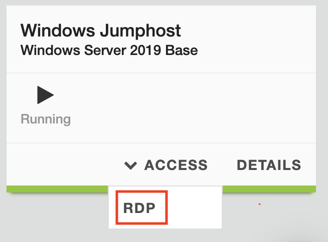
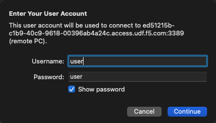
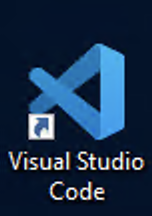
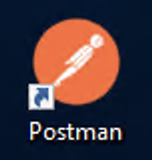
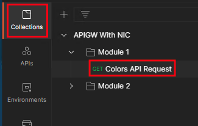
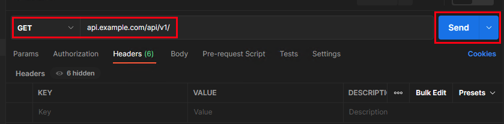
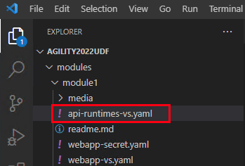

# Module 1

## Lab Environment Overview

The purpose of the first module is to give you an overview of the lab environment.  

By the end of this module you will:

1. Understand the overall architecture of this lab
2. Become familiar with the tools on the Windows Jumphost
3. Understand how to run commands to both view and make changes to the lab environment
4. Understand how to verify your work by sending traffic to the Kubernetes cluster


## Step 1

Let's begin by taking a look at the overall architecture of the lab environment.  Please review the following diagram:


As per the diagram, you will be working with a three node cluster consisting of one control-plane node and two workers.  The NGINX Ingress Controller (NIC) is deployed into the nginx-ingress namespace.  The NIC deployment is exposed with a NodePort service to make it accessible from outside of the cluster.  There are two application namespaces:  a) api and b) webapp.  The api namespace contains a number of deployments corresponding to the the API runtimes that you will access throughout the lab modules.  The webapp namespace contains a single application called frontend.  Its purpose is to generate a browser application that uses the API's to create a sentence to display on the web page.

The cluster has an external NGINX+ load balancer.  Its purpose is to load balance client API and browser requests across all of the nodes of the cluster.  

In this lab you will be working from a Windows Jumphost.  Access that environment now by navigating to the UDF lab environment, finding the Windows Jumphost component and selecting the RDP item in the Access menu.  This will download a RDP file to your workstation.  

*NOTE:  You will need an RDP client on the workstation you are running this lab from!*



Open the RDP file and log in to the jumphost with the credentials user/user.


## Step 2

Once in the Windows Jumphost, you will have access to the applications you need to complete all of the modules.  Begin by launching the VSCode application either by double clicking the desktop icon or clicking the VSCode icon in the taskbar.  


From VSCode, you will have access to all of the manifests you will need to configure the NIC to operate as an API Gateway.  VSCode also provides you with a terminal to execute `kubectl` commands from.  

You will generate API requests from the PostMan application, also installed on the Windows Jumphost.  Launch it by either double clicking the shortcut icon on the desktop or by clicking the PostMan icon on the taskbar.  


## Step 3

In this step you will explore the environment through the command line in the VSCode terminal.

Start by running the following command to display the components of the NIC:

```bash
kubectl get svc,po,deploy -n nginx-ingress
```

In the output of this command you will see information displayed on the services, pods and deployment in the nginx-ingress namespace where the NIC is installed.  Compare this to the overall architecture diagram in Step 1.

In a similar way, view the "api" namespace from the command line by executing the following:

```bash
kubectl get svc,po,deploy -n api
```

Once again, compare the output of this command with the diagram in Step 1.  

You may have noticed that unlike the diagram in Step 1, there is only a single NIC pod in the nginx-ingress namespace.  Let's change that by scaling the nginx-ingress deployment.  In your VSCode terminal, enter the following command:

```bash
kubectl scale deploy -n nginx-ingress nginx-ingress --replicas=3
```
Verify that the command worked by running the following command:

```bash
kubectl get po -n nginx-ingress
```
You should now see 3 pods listed in the output of this command.  

*Note:  In an actual production deployment you would enable Horizontal Pod Autoscaling to automatically adjust the pod count (replicas) in the deployment based on the traffic load.  That exercise is beyond the scope of this lab.*  

## Step 4

Releasing the API's.

Switch to the Postman application in the Jumphost.  In the "Collection on the left, select "APIGW With NIC". Navigate to module 1 and select "Colors API Request". 



Note that we are sending a GET request to the URL api.example.com/v1/colors.  Send this request by clicking the "Send" button to the right.  



You should see a 404 response.  The reason for this is that although the api runtimes have been exposed with a service, as shown in Step 3, those are just ClusterIP services that enable internal cluster traffic.  To create the link between the api services and the Postman client outside the cluster you need to configure the NIC to handle that traffic.  Let's do that now.

Switch to the VSCode appliction in your Jumphost.  In the upper left, navigate to the api-runtimes-vs.yaml file in the module1 directory.  



This is the manifest you will use to configure the NIC to support requests for http://api.example.com.  This manifest creates a VirtualServer resource.  VirtualServer is a "Custom Resource" (CRD) developed by NGINX.  It is one of a number of CRD's that have been developed by NGINX as an alternative to the standard Ingress Resource.  The CRD's provide easier access to the full functionality of the underlying NGINX+ load balancer.  Can you still use the standard Ingress Resource with the NGINX Inc. Ingress Controller?  Yes, in fact, you can deploy both simultaneously, a helpful capability for migrating from Ingress to CRD's.  

Inspect the manifest to get comfortable with the structure of the VirtualServer (VS).  You can read more about the VS in the official NGINX documentation here:  https://docs.nginx.com/nginx-ingress-controller/configuration/virtualserver-and-virtualserverroute-resources/.  

Apply the manifest with the following command:

```bash
kubectl apply -f modules/module1/api-runtimes-vs.yaml
```

Verify that the VS was successfully applied with the following command:

```bash
kubectl get vs -n api 
```

You should see a state of "Valid" in the listing of the "apis" VS.

Now return to Postman to resend the API request to the colors endpoint.  You should now see a JSON response with a list colors and associated ID's.  

-------------

Navigate to ([Module2](../module2/readme.md) | [Main Menu](../README.md))
