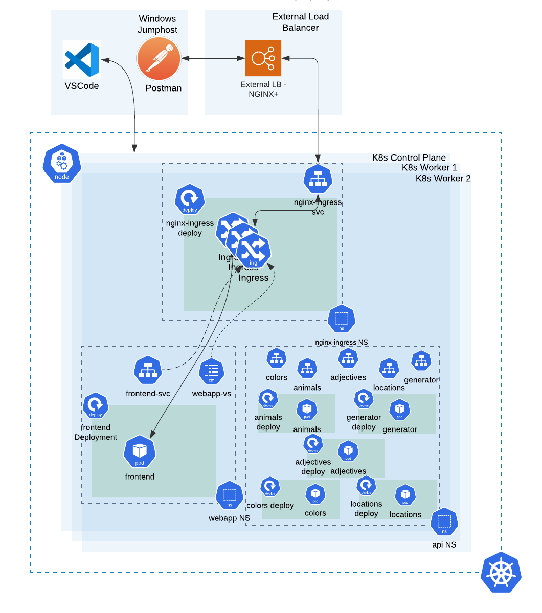
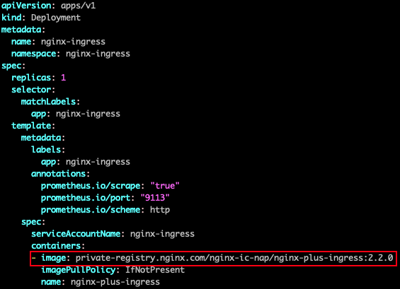
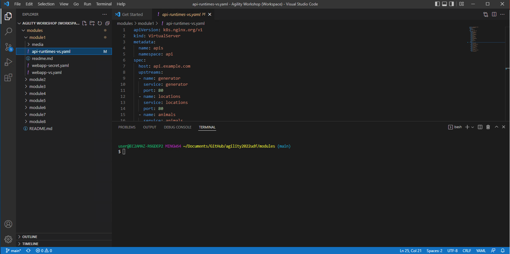
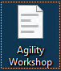
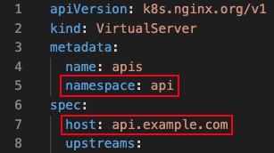
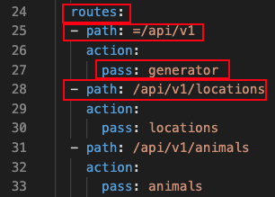
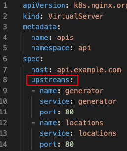

# Module 1

## Lab Environment Overview

The purpose of the first module is to give you an overview of the lab environment.  

By the end of this module you will:

1. Understand the overall architecture of this lab
2. Become familiar with the tools on the Windows Jumphost
3. Understand how to run commands to both view and make changes to the lab environment
4. Understand how to verify your work by sending traffic to the Kubernetes cluster
5. Learn about the NGINX VirtualServer CRD


## 1. Lab Environment Architecture

Let's begin by taking a look at the overall architecture of the lab environment.  Please review the following diagram:



As per the diagram, you will be working with a three node cluster consisting of one control-plane node and two workers.  

The NGINX Ingress Controller (NIC) is deployed into the `nginx-ingress` namespace.  A couple of things to note in the deployment spec:  

1. `spec.template.spec.containers.image` references the pre-built private container registry that you can use in both a trial of the NIC or as a paying subscriber.  You can also build your own container if needed.  


2. `spec.template.spec.containers.args` contain a number of optional command line arguments that can be used to enable features or control other properties of the NIC.  


The NIC deployment is exposed with a NodePort service to make it accessible from outside of the cluster.  

There are two application namespaces:  a) api and b) webapp.  The api namespace contains a number of deployments corresponding to the the API runtimes that you will access throughout the lab modules.  The webapp namespace contains a single application called frontend.  Its purpose is to generate a browser application that uses the API's to create a sentence to display on the web page.

The cluster has an external NGINX+ load balancer.  Its purpose is to load balance client API and browser requests across all of the nodes of the cluster.  

## 2. Jumphost Orientation

In this lab you will be working from a Windows Jumphost.  If you are reading this then it's likely you have successfully logged into the Jumphost.  

The two other applications you will need to complete the modules in this lab are `VSCode` and `Postman`.  VSCode is an IDE that lets you view all of the configuration files (YAML's) in the modules.  You will primarily use the integrated terminal in VSCode.  The terminal runs a `bash` shell and is configured to run `kubectl` commands (see References below if you aren't familiar with kubectl).  

Verify that VSCode is running and that it is displaying a terminal in the lower right of its window.  Here is what it looks like:



If VSCode is not running then launch it by double clicking the shortcut on the desktop. This is what it looks like:



If the terminal is not open in the VSCode window then open a new one using the Terminal menu -> New Terminal menu item.  If your VSCode has a Powershell terminal open, close it and open a Bash shell instead.  *You should run all of the commands in this workshop in a Bash terminal.*  

The second tool you will need is Postman.  Postman is a graphical tool for sending HTTP and gRPC requests and viewing the results of those requests.  If it is not already running then start it either by clicking on its icon in the taskbar or on the shortcut on the desktop.  


## 3. Getting Started at the Command Line

In this step you will explore the environment through the command line in the VSCode terminal.

Start by running the following command to display the components of the NIC:

```bash
kubectl get svc,po,deploy -n nginx-ingress
```

In the output of this command you will see information displayed on the services, pods and deployment in the `nginx-ingress` namespace where the NIC is installed.  Compare this to the overall architecture diagram in Step 1.

In a similar way, view the "api" namespace from the command line by executing the following:

```bash
kubectl get svc,po,deploy -n api
```

Once again, compare the output of this command with the diagram in Step 1.  

You may have noticed that unlike the diagram in Step 1, there is only a single NIC pod in the nginx-ingress namespace.  Let's change that by scaling the nginx-ingress deployment.  In your VSCode terminal, enter the following command:

```bash
kubectl scale deploy -n nginx-ingress nginx-ingress --replicas=3
```

Verify that the command worked by running the following command:

```bash
kubectl get po -n nginx-ingress
```

You should now see 3 pods listed in the output of this command.  

*Note:  In an actual production deployment you would enable Horizontal Pod Autoscaling to automatically adjust the pod count (replicas) in the deployment based on the traffic load.  That exercise is beyond the scope of this lab.*  

## 4. Releasing the API's

Switch to the Postman application in the Jumphost.  In the "Collection on the left, select "APIGW With NIC". Navigate to module 1 and select "Colors API Request". 


Note that you are sending a GET request to the URL `api.example.com/api/v1/colors`.  Send this request by clicking the "Send" button to the right.  


You should see a 404 response.  The reason for this is that although the api runtimes have been exposed with a service, as shown in Step 3, those are just ClusterIP services that enable internal cluster traffic.  To create the link between the api services and the Postman client outside the cluster you need to configure the NIC to handle that traffic.  Let's do that now.

Switch to the VSCode application in your Jumphost.  In the upper left, navigate to the api-runtimes-vs.yaml file in the module1 directory.  


This is the manifest you will use to configure the NIC to support requests for http://api.example.com.  This manifest creates a VirtualServer resource.  VirtualServer (VS) is a "Custom Resource" (CRD) developed by NGINX.  It is one of a number of CRD's that have been developed by NGINX as an alternative to the standard Ingress Resource.  The CRD's provide easier access to the full functionality of the underlying NGINX+ load balancer.  Can you still use the standard Ingress Resource with the NGINX Inc. Ingress Controller?  Yes, in fact, you can deploy both simultaneously, a helpful capability for migrating from Ingress to CRD's.  

Inspect the manifest to get comfortable with the structure of the VirtualServer (VS).  

A few items to note:



1. `vs.metadata.namespace` is set to `api`, meaning that the VS will be created in the `api` namespace.  In general, you will create the VS in the namespace of the application and not in the namespace of the NIC.
2. `vs.spec.host` is the FQDN that NIC will use to match the request.  It uses the `HOST` header in the request to match this value.  A big reason to use an Ingress Controller is that it supports any number of host names.  Then you just need to have your FQDN's resolve to the L4 load balancer in front of the cluster.  



1. `vs.spec.routes` is an array of maps that define the URL paths associated with api.example.com.  
2. `vs.spec.routes.path` can use either a prefix match as in the `locations` example or an exact match to a path as designated with an `=` preceeding the path as with the `generator` example.  
3. Depending on which path is matched, the corresponding action will be taken which in this example is to `pass` to an `upstream`.  



`vs.spec.upstreams` is an array of maps that refer to the Kubernetes services that front the pods we want to proxy the traffic to.  Note that NGINX does not deliver the traffic through the service to the pods, but rather, uses the service's endpoints as a means to track the pods of an application's deployment.  NGINX will directly access the pods in the cluster to deliver requests and receive application responses.  

Because the NGINX CRD's are "first class Kubernetes citizens", you can explore the VS CRD further with the `explain` sub-command to `kubectl`.  

For example, try out the following in the VSCode terminal:

```bash
kubectl explain vs
```

or

```bash
kubectl explain vs.spec.routes.action
```

You can also read more about the VS by following the link in the References section.  

Apply the manifest with the following command:

```bash
kubectl apply -f module1/api-runtimes-vs.yaml
```

Verify that the VS was successfully applied with the following command:

```bash
kubectl get vs -n api apis
```

You should see a state of "Valid" in the listing of the "apis" VS.

Now return to Postman to resend the API request to the colors endpoint.  You should now see a 200 response with a JSON response body containing a list of colors and associated ID's.  

## References:
[VirtualService Resource Documentation](https://docs.nginx.com/nginx-ingress-controller/configuration/virtualserver-and-virtualserverroute-resources/)

[Kubectl Reference](https://kubernetes.io/docs/reference/kubectl/)

-------------

Navigate to ([Module2](../module2/readme.md) | [Main Menu](../README.md))
