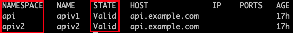

# Module 2: 

## Layer 7 Request Routing and API Versioning

As API's mature and developers continue to add features and functionality, it is oftentimes necessary to create new versions of those API's.  API versioning is accomplished in various ways.  Most commonly it is achieved by modifying the URL path so that `/api/v1/colors` becomes `/api/v2/colors`.  Alternative approaches include using a header value, e.g. `Version=1.0` or by using query parameters, e.g. `/api/colors?version=1.0`.  This module will focus on implementing versions through paths with the VirtualServerRoute (VSR) resource.  

In this module you will learn:

1. The VirtualServerRoute custom resource 
2. Cross namespace Path-Based Routing Using VirtualServerRoute

In the previous module you enabled traffic routing from outside the cluster to the API runtimes inside the cluster running in the `api` namespace.  In this module you will enable access to new versions of the API endpoints, v2, running in the apiv2 namespace.  Separating development efforts into dedicated namespaces is a good way to prevent accidental modifications to existing code.  It can also be used to enable RBAC or even Network Policy constraints.  

## 1. Background on VirtualServerRoute (VSR)  

In Module 1 you used the VirtualServer (VS) resource to configure the NGINX load balancer in the Ingress pods to proxy requests to API runtimes.  The VS includes the `vs.spec.upstreams` and `vs.spec.routes` objects.  The routes contained a `path` and an `action`.  The VSR resource lets you further define `vs.spec.routes`.  This is done by replacing `vs.spec.routes.action` with `vs.spec.routes.route`.  The "route" string references a VSR object along with the namespace it is in.  

Here is what it looks like in the VS and VSR manifests:


Where the format of `vs.spec.routes.route` is `namespace/vsr-name`

One of the main reasons for doing this is that the VSR can exists in a separate namespace than the VS that references it.  This means that, for your example lab environment, the same team that manages the apiv2 API runtimes can also manage the logic that routes traffic to it in their own VSR configuration.  And RBAC can be applied so that the apiv2 team can't modify the routing logic of api v1.

The VSR looks very much like the VS that you saw in Module 1.  One difference you will notice is that where you had `vs.spec.route`, you now have `vsr.spec.subroute`.  

Note that there are two requirements in creating the VSR.  

1. The VSR must have the same `spec.host` value as the VS 
2. The `vsr.spec.subroutes.path` must be an extension of the `vs.spec.routes.path`.  As an example, in this case you have:

```yaml
vs.spec.routes.path = /api/v1
```

and

```yaml
vsr.spec.subroutes.path = /api/v1/locations
```

This is what it looks like in the VS and VSR manifest files:


## 2. Putting VirtualServerRoute into Action

In this step you will apply a new VirtualServer manifest and create two VirtualServerRoute resources with new manifests, one for each version of your API.  

Begin by applying the new VS manifest with:

```bash
kubectl apply -f module2/api-runtimes-vs-v2.yaml
```

Note that this will overwrite the VS configuration you created in Module 1.  

If you list this new version of the VS you will note that it is in a "Warning" state:

```bash
kubectl get vs -n api apis
```


This is because it is referencing VSR's that don't exist yet.  

Let's fix that by creating the VSR's with:

```bash
kubectl apply -f module2/api-runtimes-vsr-v1.yaml
```

```bash
kubectl apply -f module2/api-runtimes-vsr-v2.yaml
```

Here is a look at the (truncated) manifest for the VSR you just created:


Notice the namespace, apiv2, and path for the v2 API's.  

Once again, get a listing of the VS in the api namespace to check its state:

```bash
kubectl get vs -n api apis
```


You should now see it in the "Valid" state.

Let's also take a look at your VSR resources with this command:

```bash
kubectl get vsr -A  # list all VSR's in all namespaces
```

Note that you have two VSR's, each in their own namespace.



## 3. Testing the New Configuration

Now that you have redeployed both the VS and VSR resources, return to Postman to test access to both the v1 and v2 API endpoints.

Navigate to the collection for Module 2.  


Run the request for "Colors API Endpoint v1".  You should see a 200 response and the response body should contain a listing of colors and associated ID's just like in Module 1.  


Great, you didn't lose any functionality with your new configuration using VS and VSR.  

Now run the request for the v2 colors API.  


You should see a 200 response and a longer list of colors and their ID's in the response body.  

-------------

Navigate to ([Module3](../module3/readme.md) | [Main Menu](../README.md))
