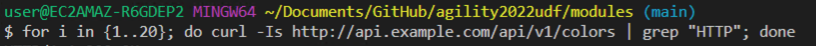

# Module 3: 

## Restricting access by applying Rate Limits on API

Once the API's start becoming feature rich, the next aspect that we need to put our attention is how to secure these API's. The most comman way of restricting your API's from getting a flood of request is to enable rate limiting. With NIC you can enable rate limiting by creating a custom policy and then applying the policy to the custom Virtual Server resource that we discussed in previous section.   

In this module you will learn:
1. Creating a custom rate limiting policy. 
2. How to modify the VS to enable rate limiting on your set of APIs
   
## 1. Creating a custom rate limiting policy

In this step you will look into a custom policy that would enable rate limiting for the colors API.

Inspect the `module3/rate-limit.yaml` manifest. This policy would limit all subsequent requests coming from a single IP address once a rate of 1 request per second is exceeded. 


`rate` field defines the rate of request permitted. The rate can be specified in requests per second(r/s) or requests per minute (r/m).

`key` field defines the key to which rate limit is applied. In above example, you are making use of `binary_remote_addr` which represents the IP of the client requesting the API. 

`zoneSize` field defines the size of the shared memory zone that maintains the state of defined keys.

Run the following command to create the custom policy within your existing setup
```bash
kubectl apply -f module3/rate-limit.yaml
```


Run the following command to view all the custom policies within a particular namespace
```bash
kubectl get policy -n api
```

## 2. How to modify the VS to enable rate limiting on your set of APIs

Once the rate limit policy has been created the next part would be to enable this policy to APIs by modifying the VirtualServer manifest. You can perform this task two ways.

1. Apply policy to all routes. (spec policies)
2. Apply policy to a specific route. (route policies)

As part of this workshop, you will apply the policy to a specific route (Colors API). For more information on how to apply policies to all routes look into the link in the [References](#references) section.

Inspect the `module3/api-runtimes-vs-with-ratelimit.yaml` manifest. We modified the API VirtualServer manifest from module1 and applied the rate limit policy to restrict the usage of Colors API.(See highlighted section in the screenshot below)


Run the following command to update the existing `apis` VirtualServer with the new changes
```bash
    kubectl apply -f module3/api-runtimes-vs-with-ratelimit.yaml
```


Now lets test the APIs and see if the rate limit is restricting traffic based on the policy that you applied.

As part of testing you would run a series of  curl commands that are run within a for loop.

Copy the below command and paste in terminal:
```bash
for i in {1..20}; do curl -Is http://api.example.com/api/v1/locations | grep "^HTTP\/"; done
```


Also run below command:
```bash
for i in {1..20}; do curl -Is http://api.example.com/api/v1/colors | grep "^HTTP\/"; done
```


What do you notice in the output of the two commands? 

For the first loop you get all `200` response status codes whereas for the second loop you get a mix of `200` and `503` response status codes. This is because you are calling the colors API in the second loop for which you have applied the rate limit policy.

`503` response status code is the default reject code within rate limit policy.

Next you would change the default reject code to `429` which is more specific reject code than the default one.

Open `module3/rate-limit.yaml` file in vscode and then add the `rejectCode` field as shown below and then save the file:


Once the `module3/rate-limit.yaml` file has been updated, you need to run below command to apply it to your cluster
```bash
kubectl apply -f module3/rate-limit.yaml
```


Once the policy is configured, run the below command to see the change.
```bash
for i in {1..20}; do curl -Is http://api.example.com/api/v1/colors | grep "^HTTP\/"; done
```

You will notice that the output now is a mix of `200` and `429` response status code. You successfully updated the rate-limit policy to return `429` reject code instead of the default generic `503` reject code.

Please look into the [References](#references) section for more information on additional fields that can be used with rate limit custom policy. 

## References:
- [Rate Limit Policy Doc](https://docs.nginx.com/nginx-ingress-controller/configuration/policy-resource/#ratelimit)
- [Various Ways of applying policies](https://docs.nginx.com/nginx-ingress-controller/configuration/policy-resource/#applying-policies)


-------------

Navigate to ([Module4](../module4/readme.md) | [Main Menu](../README.md))
