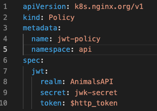

# Module 4: 

## Protecting APIs by using JWT Authentication

In last module you restricted access to an API by setting Rate Limiting. In this module you would protect your API from unwanted actors by enabling JWT authentication to your APIs. With NGINX Plus Ingress Controller(NIC) you can enable JWT authentication by creating a custom policy and then applying the policy to the custom Virtual Server resource that we worked on in previous modules.  

In this module you will learn:
1. Creating a custom JWT policy. 
2. How to modify the VirtualServer object to enable JWT authentication on your set of APIs
   
## 1. Creating a custom JWT policy

In this step you will look into a custom policy that would enable jwt for the animals API.

Inspect the `module4/jwt-policy.yaml` file. 



`realm` field defines the realm of the jwt.

`secret` field defines the name of the Kubernetes secret that stores the JWK. This secret needs to be in the same namespace as the Policy resource. The secret must also be of the type `nginx.org/jwk` otherwise the secret will be rejected as invalid. In above example, you are making use of `jwk-secret` which you will create in `api` namespace before creating this policy.

`token` field specifies a variable that would hold the JSON Web Token in incoming request. By default the JWT is passed in the Authorization header as a Bearer Token. JWT may also be passed as a cookie or part of the quary string. In above example, you define a request header field named `token` that would contain the JWT.


Run the following command to create the custom policy within your existing setup
```bash
kubectl apply -f module3/rate-limit.yaml
```


Run the following command to view all the custom policies within a particular namespace
```bash
kubectl get policy -n api
```

## 2. How to modify the VirtualServer object to enable rate limiting on your set of APIs

Once the rate limit policy has been created the next part would be to enable this policy to APIs by modifying the VirtualServer object. You can perform this task two ways.

1. Apply policy to all routes. (spec policies)
2. Apply policy to a specific route. (route policies)

As part of this workshop, you will apply the policy to a specific route (Colors API). For more information on how to apply policies to all routes look into the link in the [References](#references) section.

Inspect the `module3/api-runtimes-vs-with-ratelimit.yaml` file. We modified the `apis` VirtualServer object from module 1 and applied the rate limit policy to restrict the usage of Colors API. (See highlighted section in the screenshot below)


Run the following command to update the existing `apis` VirtualServer object with the new changes
```bash
    kubectl apply -f module3/api-runtimes-vs-with-ratelimit.yaml
```


Now lets test the APIs and see if the rate limit is restricting traffic based on the policy that you applied.

As part of testing you would run a series of curl commands that are placed within a for loop and iterated 20 times.

Copy the below command and paste in terminal:
```bash
for i in {1..20}; do curl -Is http://api.example.com/api/v1/locations | grep "HTTP"; done
```


Also run below command:
```bash
for i in {1..20}; do curl -Is http://api.example.com/api/v1/colors | grep "HTTP"; done
```


What do you notice in the output of the two commands? 

For the first command you get all `200` response status codes whereas for the second command you get a mix of `200` and `503` response status codes. This is because you are calling the colors API in the second command for which you have applied the rate limit policy.

**Note:** `503` response status code is the default reject code within rate limit policy.

Next you would change the default reject code to `429` which is more specific reject code than the default one.

Open `module3/rate-limit.yaml` file in vscode and then add the `rejectCode` field as shown below and then save the file:


Run the following command to update the existing `rate-limit-policy` policy object with the new changes
```bash
kubectl apply -f module3/rate-limit.yaml
```


Once the policy is configured, run the below command to see the change.
```bash
for i in {1..20}; do curl -Is http://api.example.com/api/v1/colors | grep "HTTP"; done
```


You will notice that the output now is a mix of `200` and `429` response status code. You successfully updated the rate-limit policy to return `429` reject code instead of the default generic `503` reject code.

Please look into the [References](#references) section for more information on additional fields that can be used with rate limit custom policy. 

## References:
- [Rate Limit Policy Doc](https://docs.nginx.com/nginx-ingress-controller/configuration/policy-resource/#ratelimit)
- [Various Ways of applying policies](https://docs.nginx.com/nginx-ingress-controller/configuration/policy-resource/#applying-policies)


-------------

Navigate to ([Module5](../module5/readme.md) | [Main Menu](../README.md))
