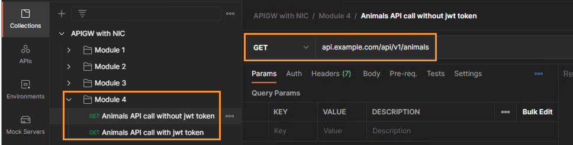
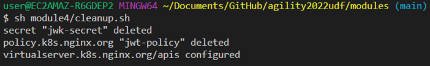

# Module 4: 

## Protecting APIs by using JWT Authentication

In the last module you restricted access to an API by setting Rate Limiting. In this module you will protect your API from unwanted actors by enabling JWT authentication to your APIs. With NGINX Plus Ingress Controller(NIC) you can enable JWT authentication by creating a custom policy and then applying the policy to the custom Virtual Server resource that you worked on in previous modules.  

In this module you will learn:

1. How to create a custom JWT policy. 
2. How to modify the VirtualServer object to enable JWT authentication on your set of APIs

## 1. Creating a custom JWT policy

In this step you will look into a custom policy that enables jwt for the animals API.

Inspect the `module4/jwt-policy.yaml` file. 


The `realm` field defines the realm of the jwt.

The `secret` field defines the name of the Kubernetes secret that stores the JWK. This secret needs to be in the same namespace as the Policy resource. The secret must also be of the type `nginx.org/jwk` otherwise the secret will be rejected as invalid. In above example, you are making use of `jwk-secret` which you will create in `api` namespace before creating this policy. (Feel free to inspect the `module4/jwk-secret.yaml` file)

The `token` field specifies a variable that would hold the JSON Web Token in incoming request. By default the JWT is passed in the Authorization header as a Bearer Token. JWT may also be passed as a cookie or part of the quary string. In the example above, you define a request header field named `token` that contains the JWT.

Run the following command to create the `jwk-secret` which is used in the JWT custom policy.

```bash
kubectl apply -f module4/jwk-secret.yaml
```


Once the secret has been created you will create the JWT custom policy by running the following command. 

```bash
kubectl apply -f module4/jwt-policy.yaml
```


Run the following command to view all the custom policies within the api namespace

```bash
kubectl get policy -n api
```

## 2. How to modify the VirtualServer object to enable JWT authentication on your set of APIs

Once the JWT policy has been created the next step is to enable this policy to the APIs by modifying the VirtualServer object. This process is the same as applying the rate limit policy that you saw in the last section. You can perform this task two ways.

1. Apply policy to all routes. (spec policies)
2. Apply policy to a specific route. (route policies)

As part of this workshop, you will apply the policy to a specific route (Animals API). For more information on how to apply policies to all routes look into the link in the References section.

Inspect the `module4/api-runtimes-vs-with-jwt.yaml` file. This file modifies the `apis` VirtualServer object from module 1 and applies the jwt policy to restrict the usage of Animals API. (See highlighted section in the screenshot below)


Run the following command to update the existing `apis` VirtualServer object with the new changes

```bash
kubectl apply -f module4/api-runtimes-vs-with-jwt.yaml
```


Now lets test the API and see what responses you get when you access the Animals API with/without JWT token in the request header.

As part of testing, based on your preference, you can either use postman tool or you can run curl commands to make calls to the Animals API endpoint.

### Testing via Postman

Switch to the Postman application in the Jumphost. In the "*Collection*" on the left, select "*APIGW With NIC*". Navigate to module 4.



Run the first request "*Animals API call without jwt token*".  You should see a `401 Unauthorized` response code with the relevant response body stating "*Authorization Required*".


You are receiving this response as the JWT policy has been applied to Animals API and you are not allowed to access this API endpoint without passing a JWT token in the request header.

Run the second request "*Animals API calls with jwt token*". You should see a `200 OK` response code and the response body should contain a listing of animals and associated ID's. 


If you closely look into the request in above screenshot, you should see a key named `token` has been added to the request header. This key stores a valid jwt token and is passed with the request.

### Testing via cURL

Within the vscode terminal, run the below curl command to send a request to Animals API. On running the curl command, you should see a `401 Unauthorized` response code with the relevant response body stating "*Authorization Required*".

```bash
curl -i http://api.example.com/api/v1/animals
```


You are receiving this response as the JWT policy has been applied to Animals API and you are not allowed to access this API endpoint without passing a JWT token in the request header.

Run the below curl command. This time you should see a `200 OK` response code and the response body should contain a listing of animals and associated ID's.

```bash
curl -i http://api.example.com/api/v1/animals -H "token: `cat module4/token.jwt`" 
```


As part of the second curl command, you are adding a key named `token` in the request header. This key stores a valid jwt token and is passed with the request.

Please look into the References section for more information on JWT custom policy. 

Before moving to the next module run the below command so that we cleanup the objects that we created in this module.

```bash
sh module4/cleanup.sh
```



## References:

- [JWT Policy Doc](https://docs.nginx.com/nginx-ingress-controller/configuration/policy-resource/#jwt)
- [Various Ways of applying policies](https://docs.nginx.com/nginx-ingress-controller/configuration/policy-resource/#applying-policies)

-------------

Navigate to ([Module5](../module5/readme.md) | [Main Menu](../README.md))
