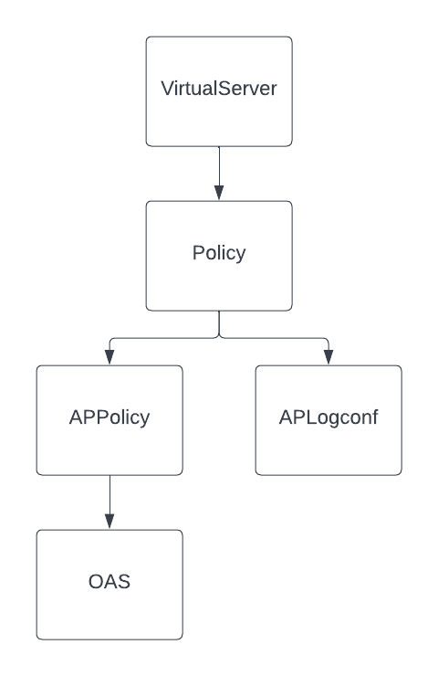
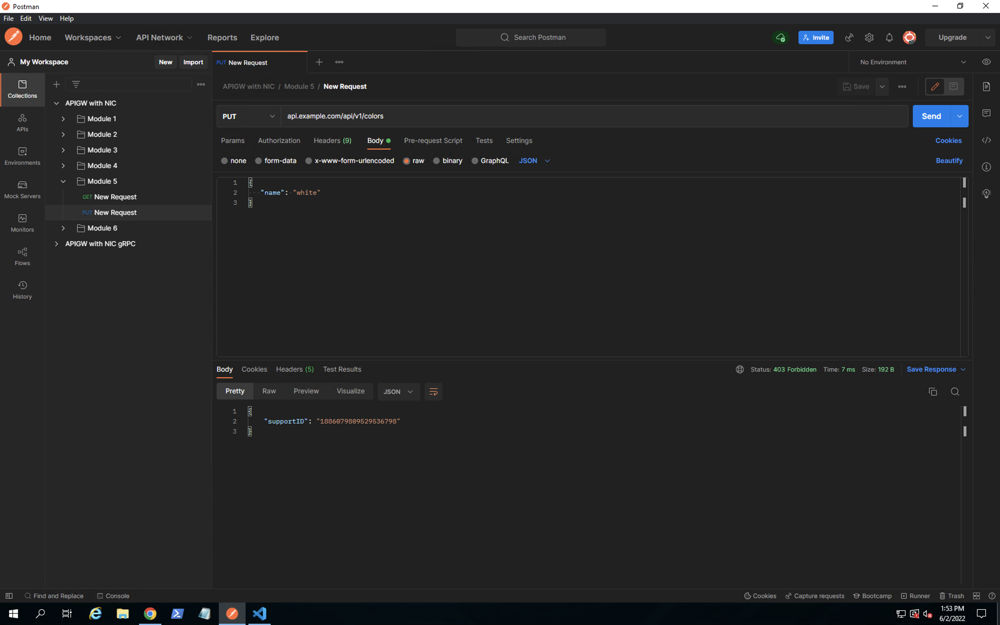
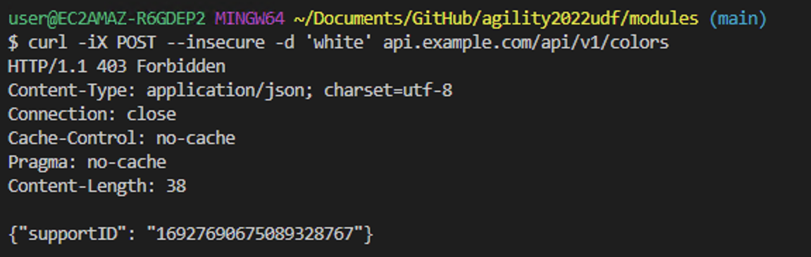

# Module 5: 

## Protecting APIs using NGINX APP Protect 

In the last module you protected your API from unwanted actors by enabling JWT authentication to your APIs. In this module you will protect your API against L7 attacks by enabling NGINX APP Protect (NAP) WAF. With NGINX Plus Ingress Controller (NIC) you can enable NGINX APP Protect by creating a custom policy and then applying the policy to the custom Virtual Server resource that you worked on in previous modules.  

In this module you will learn:

1. The CRD's involved in applying and customizing NAP for the NIC
2. How to create a custom NGINX APP Protect policy. 
3. How to modify the VirtualServer object to enable NGINX APP Protect policy on your set of APIs

## 1. CRD's to Enable and Customize NAP for the NIC

The following diagram shows the CRD's involved in enabling and customizing NAP:  



1. The VirtualServer resource refers to a Policy resource in the same way that you have already seen for modules 3 and 4.
2. The Policy resource for NAP is of type `waf`.  In the prior modules you worked with policies of type `jwt` and `rateLimit`.  
3. The `waf` policy type refers to two new CRD's, namely, APPolicy and APLogConf.  APPolicy is where you define your WAF rules.  NAP provides an "out of the box" set of rules that can be customized in various ways.  APLogConf configures NAP logging.  In this module you will deploy a syslog pod to act as the log repository.
4. One way of customizing the NAP rules is by referencing an OAS spec to create a very specific NAP policy. This NAP policy will ensure that any request to the API endpoint complies with the OAS or it will be blocked by NAP. This policy is in addition to the F5/NGINX provided policies.  
 
## 2. Create an App Protect Policy

In this step you will apply a custom policy that enables NGINX App Protect Policy for the colors API.

Inspect the `module5/ap-policy.yaml` file. This is where we define our App Protect policy custom resource. Notice towards the bottom of the spec we reference the NGINX base template this is the common starting point to any policy you write. We also set this policy in a blocking enforcement mode, meaning any illegal or suspicious requests are logged and blocked. App Protect allows you to reference a file on an external http server or locally on the file system of the NGINX instance. Notice how we reference an open api spec file or OAS for short, (https://gitlab.com/sentence-app/adjectives/-/raw/main/oas-adjectives-v0.1.yaml). We can use this for a very accurate policy for protecting these APIs. 

Now lets apply the manifest 

```bash
    kubectl apply -f module5/ap-policy.yaml
```

Inspect the `module5/ap-logconf.yaml`file. This is where we define our App Protect logging. The spec consists of two parts, filter: which requests are to be logged and content: how the message is formatted. 

Now lets apply the manifest.

```bash
    kubectl apply -f module5/ap-logconf.yaml
```

Inspect the `module5/syslog.yaml`file. We stream our NAP logs into this syslog deployment.

Now lets apply the manifest.

```bash
    kubectl apply -f module5/syslog.yaml
```

Inspect the `module5/waf.yaml`file. This is where we specify the above manifest files.

Now lets apply the manifest.

```bash
    kubectl apply -f module5/waf.yaml
```

Inspect the `module5/ap-uds.yaml`file. This is where we define our App Protect User Defined Signatures. This capability allows the user to define new signatures, configure how they behave in terms of enforcement, and categorize them in user-defined signature sets (using tags) for ease of management. Tags help organizing the user-defined signatures in bundles so that all signatures in that bundle are (usually) authored by the same person and share a common purpose or set of applications that will consume it. It also creates name spaces that avoid name conflicts among user-defined signatures. Signatures are uniquely identified by the combination of tag and name. 

Now lets apply the manifest.

```bash
    kubectl apply -f module5/ap-uds.yaml
```

## 3. How to modify the VirtualServer object to enable NGINX APP Protect policy on your set of APIs

Once the App Protect policy has been created the next step is to enable this policy to the APIs by modifying the VirtualServer object. This process is the same as applying the JWT policy that you saw in the last section. You can perform this task two ways.

1. Apply policy to all routes. (spec policies)
2. Apply policy to a specific route. (route policies)

As part of this workshop, you will apply the policy to a specific route (Colors API). For more information on how to apply policies to all routes look into the link in the References section.

Inspect the `module5/api-runtimes-vs-with-waf.yaml` file. This file modifies the `apis` VirtualServer object from module 1 and applies the App Protect policy to restrict the usage of Colors API. 

Now lets test the API and see what responses you get when you access the Colors API with/without App Protect Policy.

As part of testing, based on your preference, you can either use postman tool or you can run curl commands to make calls to the Colors API endpoint.


### Testing via Postman
Switch to the Postman application in the Jumphost. In the "Collection" on the left navigate to module 5, select the POST call. 

click Send, You should see a 200 response code.

Run the following command to update the existing `apis` VirtualServer object with the App Protect policy and associated manifests. 

```bash
    kubectl apply -f module5/api-runtimes-vs-with-waf.yaml
```

Now go back to the Postman application in the Jumphost. In the "Collection" on the left navigate to module 5, select the POST call. 


click Send, You should see a 403 Unauthorized response code with the relevant response body and a support ID.




### Testing via cURL 

Run the below curl command. You should see a `200 OK` response code.

```bash
curl -iX POST --insecure -d 'white' api.example.com/api/v1/colors
```

You are receiving this response because the App Protect Policy has not been applied to the colors API and you are allowed to access this API endpoint without violating the policy.

Run the following command to update the existing `apis` VirtualServer object with the App Protect policy and associated manifests. 

```bash
    kubectl apply -f module5/api-runtimes-vs-with-waf.yaml
```

Within the vscode terminal, run the below curl command to send a request to Colors API. On running the curl command, you should see a 403 Unauthorized response code with the relevant response body and a support ID.

```bash
curl -iX POST --insecure -d 'white' api.example.com/api/v1/colors
```



Please look into the References section for more information on NGINX App Protect. 

## References:
- [NGINX Ingress Controller App Protect Configuration Doc](https://docs.nginx.com/nginx-ingress-controller/app-protect/configuration) 
- [Various Ways of Applying Policies](https://docs.nginx.com/nginx-ingress-controller/configuration/policy-resource/#applying-policies)
- [NGINX App Protect Configuration Doc](https://docs.nginx.com/nginx-app-protect/configuration-guide/configuration)
- [App Protect Declarative Policy Doc](https://docs.nginx.com/nginx-app-protect/declarative-policy/policy)

-------------

Navigate to ([Module6](../module6/readme.md) | [Main Menu](../README.md))
