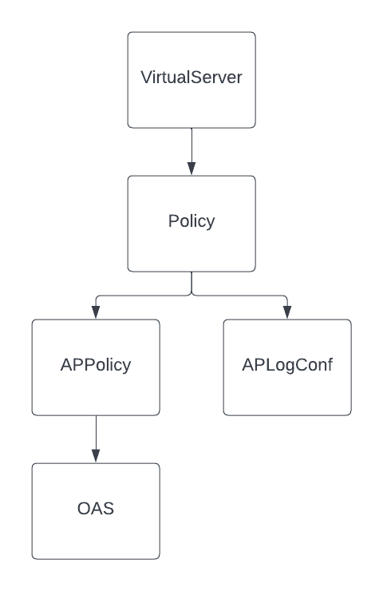
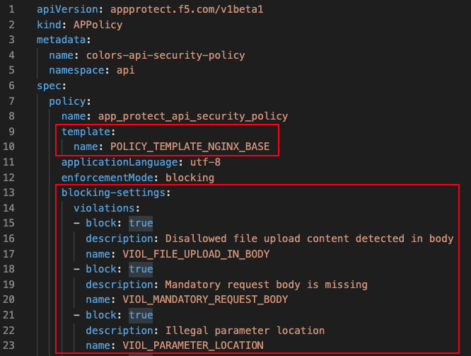
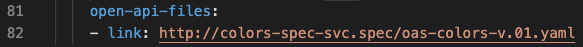
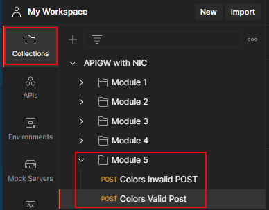
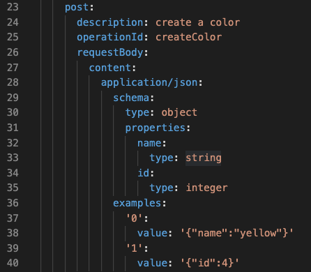
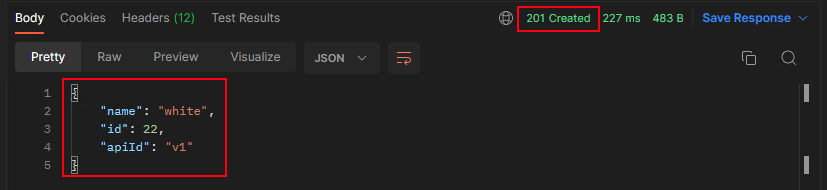
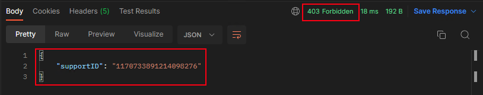

# Module 5: 

## Protecting APIs using NGINX APP Protect 

In the last module you protected your API from unwanted actors by enabling JWT authentication to your APIs. In this module you will protect your API against L7 attacks by enabling NGINX APP Protect (NAP) WAF. With NGINX Plus Ingress Controller (NIC) you can enable NGINX APP Protect by creating a custom policy and then applying the policy to the custom Virtual Server resource that you worked on in previous modules.  

In this module you will learn:

1. The CRD's involved in applying and customizing NAP for the NIC
2. How to create a custom NGINX APP Protect policy. 
3. How to modify the VirtualServer object to enable NGINX APP Protect policy on your set of APIs

## 1. CRD's to Enable and Customize NAP for the NIC

The following diagram shows the CRD's involved in enabling and customizing NAP along with how they are related to each other:  



1. The VirtualServer resource refers to a Policy resource in the same way that you have already seen for modules 3 and 4.
2. The Policy resource for NAP is of type `waf`.  In the prior modules you worked with policies of type `jwt` and `rateLimit`.  
3. The `waf` policy type refers to two new CRD's, namely, APPolicy and APLogConf.  APPolicy is where you define your WAF rules.  NAP provides an "out of the box" set of rules that can be customized in various ways.  APLogConf configures NAP logging.  In this module you will deploy a syslog pod to act as the log repository.
4. One way of customizing the NAP rules is by referencing an OAS spec to create a very specific NAP policy, tailored to your API. This NAP policy will ensure that any request to the API endpoint complies with the OAS or it will be blocked by NAP. This policy is in addition to the F5/NGINX provided base policies.  
 
## 2. Create an App Protect Policy

In this step you will apply a custom policy that enables NGINX App Protect Policy for the colors API.

Inspect the `module5/ap-policy-api.yaml` file.



Some items to note:  

1. This is where we define our App Protect policy custom resource. `spec.policy.template` references the NGINX base template. This is the common starting point to any policy you write. We also set this policy in a blocking enforcement mode, meaning any illegal or suspicious requests are logged and blocked. 
2. `spec.policy.blocking-settings.violations` are an array of API specific signatures that can block if the request does not match the OpenAPI Spec.



3. App Protect allows you to reference a file on an external http server or locally on the file system of the NGINX instance. Notice how we reference an open api spec file or OAS for short, (http://colors-spec-svc.spec/oas-colors-v.01.yaml).  We can use this for a very accurate policy for protecting these APIs.

Now lets apply the manifest and create the APPolicy resource:

```bash
    kubectl apply -f module5/ap-policy-api.yaml
```

Inspect the `module5/ap-logconf.yaml`file. This is where we define our App Protect logging. The spec consists of two parts, filter: which requests are to be logged and content: how the message is formatted. 

Now lets apply the manifest and create the APLogConf resource:

```bash
    kubectl apply -f module5/ap-logconf.yaml
```

Inspect the `module5/syslog.yaml`file. We stream our NAP logs into this syslog deployment.

Now lets apply the manifest.

```bash
    kubectl apply -f module5/syslog.yaml
```

Inspect the `module5/waf-policy.yaml`file. This creates the new Policy object that specifies the above manifest files.

Now lets apply the manifest.

```bash
    kubectl apply -f module5/waf-policy.yaml
```

## 3. How to modify the VirtualServer object to enable NGINX APP Protect policy on your set of APIs

Once the App Protect policy has been created the next step is to enable this policy to the APIs by modifying the VirtualServer object. This process is the same as applying the JWT policy that you saw in the last module. You can perform this task two ways.

1. Apply policy to all routes. (spec policies)
2. Apply policy to a specific route. (route policies)

As part of this workshop, you will apply the policy to a specific route (Colors API). For more information on how to apply policies to all routes look into the link in the References section.

Inspect the `module5/api-runtimes-vs-with-waf.yaml` file. This file modifies the `apis` VirtualServer object from module 1 and applies the App Protect policy, "waf-policy", to block attacks against the Colors API.

Run the following command to update the existing `apis` VirtualServer object with the App Protect policy and associated manifests.

```bash
    kubectl apply -f module5/api-runtimes-vs-with-waf.yaml
```

Now lets test the API and see what responses you get when you access the Colors API with the App Protect Policy.

### Testing NAP with Postman

Switch to the Postman application in the Jumphost. In the "Collections" on the left navigate to Module 5,



Select the "Colors Valid POST" call.  Note that it will post a JSON body to the /colors API.  The JSON payload contains the two allowed items for a POST, namely, name and id fields.  See the following snippet of the OpenAPI Spec:



Click Send. You should see a 201 response code in accordance with the OAS. The response body contains the payload sent along with the apiID.  



Now select the "Colors Invalid POST" call.  Note that the request payload contains a number of invalid elements such as incorrect data types, malformed JSON (missing comma) and invalid parameter.  Click the "Send" button and observe the response.  



You should have received a 403 Unauthorized response with a response body containing a Support ID in JSON format.  This is the standard NAP response body.  The Support ID can be used to find the policy that was violated in the NAP logs.  

Finally, select the "Colors XSS API Call" in Postman.  Note the request URL.  This request sends what looks like a Cross Site Scripting attack.  This is one of the standard OWASP Top 10 attacks against web applications.  It is one of the policies that you enabled with the NGINX Base Template we saw referenced in the APPolicy manifest.  You should see the same type of response as with the Invalid POST in the previous step.  

Please check the References section for more information on NGINX App Protect. 

## References:
- [NGINX Ingress Controller App Protect Configuration Doc](https://docs.nginx.com/nginx-ingress-controller/app-protect/configuration) 
- [Various Ways of Applying Policies](https://docs.nginx.com/nginx-ingress-controller/configuration/policy-resource/#applying-policies)
- [NGINX App Protect Configuration Doc](https://docs.nginx.com/nginx-app-protect/configuration-guide/configuration)
- [App Protect Declarative Policy Doc](https://docs.nginx.com/nginx-app-protect/declarative-policy/policy)

-------------

Navigate to ([Module6](../module6/readme.md) | [Main Menu](../README.md))
