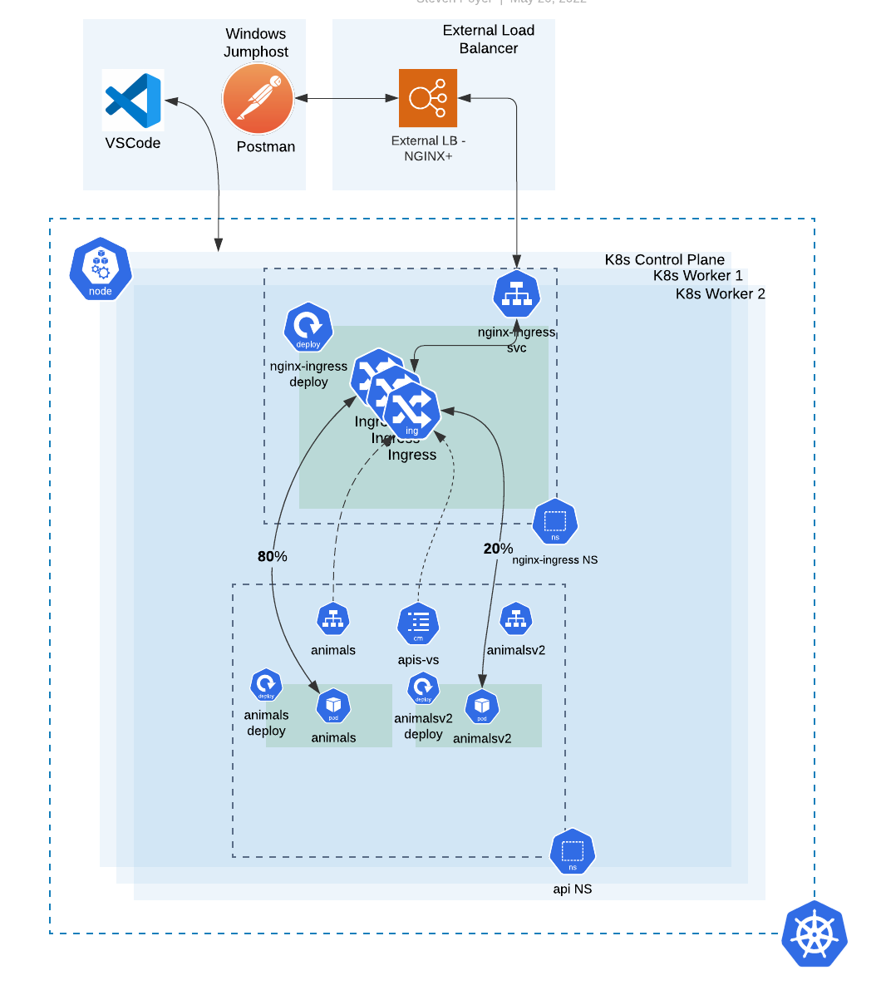

# Module 6:


### Canary Testing


During the development cycle of modern applications for Kubernetes, developers will often want to test new versions of their software, using various test tools, and ideally, a final check with live customer traffic.  One common method of doing this is called a "Canary Deployment".  In a Canary Deployment you take a percentage of your live traffic and divert it to a new version of your API endpoint.  

Nginx Plus Ingress Controller can do this, using a feature called `HTTP Split Clients.`  This feature allows you to define a percentage of traffic to be split between different k8s applications, and in this case, different versions of your application.

In this module you will:

1. Become familiar with the Canary Deployment lab environment
2. Learn the elements in the VirtualServer CRD to create a Canary Deployment
3. Test the new VS to verify traffic is being split to the application versions

You will use the currently running animals deployment and deploy a new, V2 version of animals to the same namespace.  The traffic will be split at an 80:20 ratio between animals and animalsv2 applications.  

## 1. Become Familiar with and Build the Environment 

Refer to the following diagram to become familiar with module's environment. 



The environment relative to the NGINX Ingress Controller (NIC) is the same as before.  The api Namespace has been simplified to help focus on the applications we will be testing:  Namely, animals and animalsv2.  We will be relying on the NIC as our API Gateway to send a portion of the traffic to our current version of the API runtime and a smaller portion to our new version.  

Note that a given client may get the original version on one request and the new version on a subsequent request.  You would need to determine whether this would make sense for your application of if that has the potential to break things.  If you needed the client to return to the same version each time then additional configuration would need to be implemented for stickiness to a version.  

If you inspect the environment you will notice that the new version of animals hasn't been deployed yet.  Let's do that now
## 2. Learn the Updated VS Manifest
2. Check the Plus Dashboard, there should only be one coffee and one tea upstream now.

    

    Inspect the `lab10/cafe-bluegreen-vs.yaml` file, and note the `split and weight` directives on lines 49-56.

    

3. Next, remove the existing VirtualServer for mTLS from the previous exercise:

    ```bash
    kubectl delete -f lab10/cafe-mtls-vs.yaml
    ```

4. Now configure the Cafe Virtual Server to send 80% traffic to coffee-mtls, and 20% traffic to tea-mtls:

    ```bash
    kubectl apply -f lab10/cafe-bluegreen-vs.yaml
    ```

5. Open a Chrome tab for https://cafe.example.com/coffee, and check the Auto Refresh box at the bottom of the page.

    

    Check the statistics on the Plus Dashboard cafe-bluegreen upstreams.... Do you see approximately an 80/20 Requests ratio between coffee and tea?  You can configure the ratio in 1% increments, from 1-99%.  

    **Note:** Nginx will not load the Split configuration, if the ratio does not add up to 100%.

    

    > **Important!**   You are still using the https://cafe.example.com/coffee URL - you did not have to change the PATH of the url, but Nginx Ingress Controller is routing the requests to 2 different services, 80% to coffee-mtls AND 20% to tea-mtls!   This allows for easy testing of new application versions, without requiring DNS changes, new URLs or URIs, or other system changes.

<br/>


-------------

Navigate to ([Module7](../module7/readme.md) | [Main Menu](../README.md))
