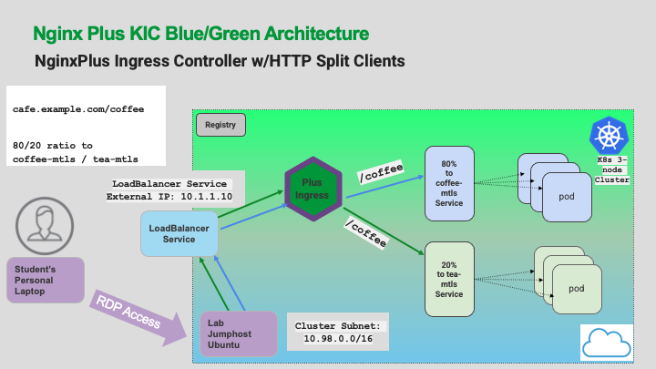

# Module 6: 


### Blue/Green | A/B Testing

<br/>


<br/>

During the development cycle of modern applications for Kubernetes, developers will often want to test new versions of their software, using various test tools, and ideally, a final check with live customer traffic.  There are several names for this dev/test concept - `Blue/Green deployments, A/B testing, Canary testing,` etc.  

However, switching ALL customers to new versions that might still have a few bugs in the code is quite risky.  

> Wouldn't it be nice if your Ingress Controller could split off just a small fraction of your live traffic, and route it to your new application pod for final testing?  

Nginx Plus Ingress Controller can do this, using a feature called `HTTP Split Clients.`  This feature allows you to define a percentage of traffic to be split between different k8s Services, representing different versions of your application.

You will use the currently running Cafe-mTLS coffee and tea pods, and split the traffic at an 80:20 ratio between coffee and tea Services.  

Refer to the following diagram for testing Blue/Green traffic splitting with Nginx Plus Ingress Controller:



**Assume that coffee is your existing application, and tea is your new test build of the application.**  

Having read the tea leaves you are highly confident in your new code. So you decide to route 20% of your live traffic to tea. (crossing your fingers)

1. First, to see the split ratio more clearly, scale down the number of coffee and tea pods to just one each:

    ```bash
    kubectl scale deployment coffee-mtls --replicas=1
    kubectl scale deployment tea-mtls --replicas=1
    ```

2. Check the Plus Dashboard, there should only be one coffee and one tea upstream now.

    

    Inspect the `lab10/cafe-bluegreen-vs.yaml` file, and note the `split and weight` directives on lines 49-56.

    

3. Next, remove the existing VirtualServer for mTLS from the previous exercise:

    ```bash
    kubectl delete -f lab10/cafe-mtls-vs.yaml
    ```

4. Now configure the Cafe Virtual Server to send 80% traffic to coffee-mtls, and 20% traffic to tea-mtls:

    ```bash
    kubectl apply -f lab10/cafe-bluegreen-vs.yaml
    ```

5. Open a Chrome tab for https://cafe.example.com/coffee, and check the Auto Refresh box at the bottom of the page.

    

    Check the statistics on the Plus Dashboard cafe-bluegreen upstreams.... Do you see approximately an 80/20 Requests ratio between coffee and tea?  You can configure the ratio in 1% increments, from 1-99%.  

    **Note:** Nginx will not load the Split configuration, if the ratio does not add up to 100%.

    

    > **Important!**   You are still using the https://cafe.example.com/coffee URL - you did not have to change the PATH of the url, but Nginx Ingress Controller is routing the requests to 2 different services, 80% to coffee-mtls AND 20% to tea-mtls!   This allows for easy testing of new application versions, without requiring DNS changes, new URLs or URIs, or other system changes.

<br/>


-------------

Navigate to ([Module7](../module7/readme.md) | [Main Menu](../README.md))
