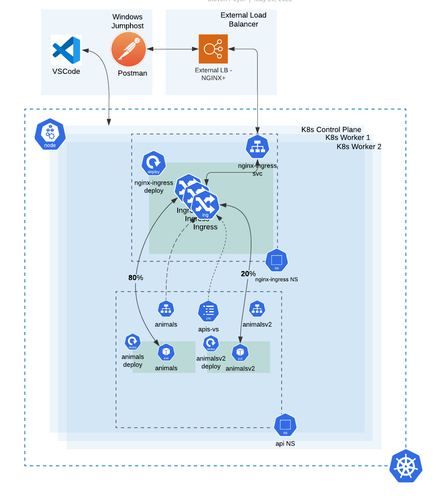
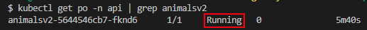
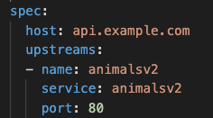
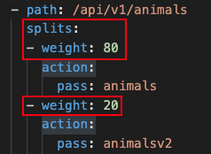
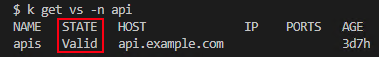
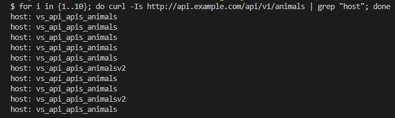

# Module 6

### Canary Testing


During the development cycle of modern applications for Kubernetes, developers will often want to test new versions of their software, using various test tools, and ideally, a final check with live customer traffic.  One common method of doing this is called a "Canary Deployment".  In a Canary Deployment you take a percentage of your live traffic and divert it to a new version of your API endpoint.  

Nginx Plus Ingress Controller can do this, using a feature called `HTTP Split Clients.`  This feature allows you to define a percentage of traffic to be split between different k8s applications, and in this case, different versions of your application.

In this module you will:

1. Become familiar with the Canary Deployment lab environment
2. Learn the elements in the VirtualServer CRD to create a Canary Deployment
3. Test the new VS to verify traffic is being split to the application versions

You will use the currently running animals deployment and deploy a new, V2 version of animals to the same namespace.  The traffic will be split at an 80:20 ratio between animals and animalsv2 applications.  

## 1. Become Familiar with and Build the Environment

Refer to the following diagram to become familiar with module's environment.



The environment relative to the NGINX Ingress Controller (NIC) is the same as before.  The api Namespace has been simplified to help focus on the applications we will be testing:  Namely, animals and animalsv2.  We will be relying on the NIC as our API Gateway to send a portion of the traffic to our current version of the API runtime and a smaller portion to our new version.  

Note that a given client may get the original version on one request and the new version on a subsequent request.  You would need to determine whether this would make sense for your application of if that has the potential to break things.  If you needed the client to return to the same version each time then additional configuration would need to be implemented for stickiness to a version.  

If you inspect the environment you will notice that the new version of animals hasn't been deployed yet.  Let's do that now.

Run the following command to deploy the new version of animals, animals-v2:

```bash
kubectl apply -f module6/animals-v2.yaml -n api
```

This will create both a service called animalsv2 and and a deployment with the same name and with a single pod.  Verify the pod is running with:

```bash
kubectl get po -n api | grep animalsv2
```

You should now see a single pod with a status of "Running"



## 2. Learn and Apply the Updated VS Manifest

Creating this canary deployment is only a slight modification to the VirtualServer manifest you have been looking at since Module1.  The first change is the addition of the animalsv2 upstream.  



The second change comes in the new spec.routes.splits entry.  The splits are further defined by the weights entries.  For example:



The weights each have their own action which, in our case, passes to the two versions of the animals upstreams.  

**Note:** Nginx will not load the Split configuration, if the ratio does not add up to 100%.

Apply the updated VS manifest with the command:

```bash
kubectl apply -f module6/api-runtimes-canary-vs.yaml
```

Verify that the VirtualServer object was updated successfully by running:

```bash
kubectl get vs -n api
```

You should see the following:




## 3. Testing the Canary Deployment

Now check that the requests are being distributed to the two animal versions.

Run the following:

```bash
for i in {1..10}; do curl -Is http://api.example.com/api/v1/animals | grep -i "host"; done
```

You should see roughly 8 responses from the original animals API endpoint and 2 from the new animalsv2 endpoint.



You can configure the ratio in 1% increments, from 1-99%.  

**Note!**   You are still using the http://api.example.com/animals URL - you did not have to change the PATH of the url.  Nginx Ingress Controller is routing the requests to 2 different services, 80% to animals AND 20% to animalsv2.   This allows for easy testing of new application versions, without requiring DNS changes, new URLs or URIs, or other system changes.


-------------

Navigate to ([Module7](../module7/readme.md) | [Main Menu](../README.md))
