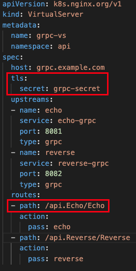
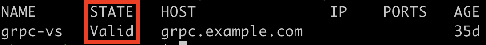
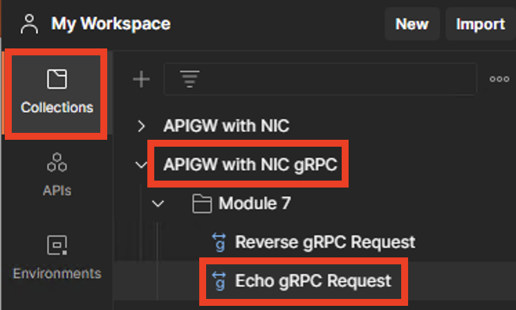
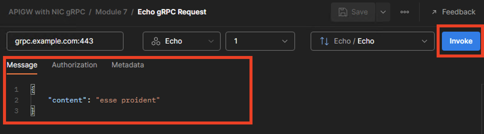
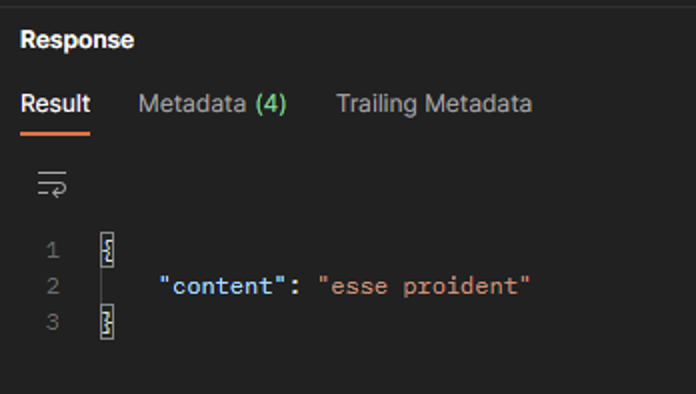
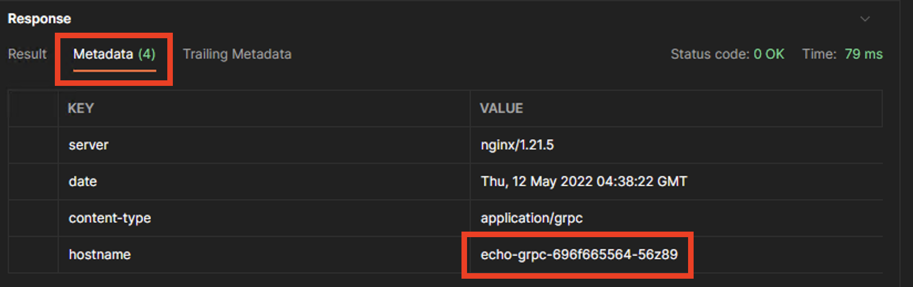

# Module 7

## gRPC Routing and Load Balancing

One fairly recent trend in API technology is the move to gRPC.   gRPC is becoming a popular alternative to JSON RESTful API's in part because of a 7 to 10 times performance improvement over REST.  This is due in part to the use of HTTP2.  NGINX has gRPC proxy and load balancing capabilities built in.  Moreover, we can enable our Ingress Controller to route and load balance gRPC traffic with the VirtualServer custom resource.  

In this module you will learn:
1. Basic gRPC concepts
2. How our gRPC demonstration application works
3. How to configure the NIC to proxy and load balance gRPC traffic

## 1. A Short Introduction to gRPC Concepts

gRPC is a modern, open source, high-performance Remote Procedure Call framework. It can be run on any environment and can be used to communicate across backend, frontend, and mobile devices.

More on gRPC from Google:

> gRPC is a high performance, open-source universal RPC framework, developed by Google. In gRPC, a client application can directly call methods on a server application on a different machine as if it was a local object, making it easier to create distributed applications and services.

Also from Google:

> gRPC is based on the idea of defining a service, specifying the methods that can be called remotely with their parameters and return types. By default, gRPC uses protocol buffers as the Interface Definition Language (IDL) for describing both the service interface and the structure of the payload messages.

## 2. Intro to Our gRPC Lab Application

For our simple lab application, we have two application services, namely, "echo" and "reverse".  In gRPC, the application service is defined using a ".proto" file.  For example, the .proto for the echo service is:

```json
syntax = "proto3";

option go_package = "github.com/googlecloudplatform/grpc-gke-nlb-tutorial/echo-grpc/api";

package api;

service Echo {
  rpc Echo (EchoRequest) returns (EchoResponse) {}
}

message EchoRequest {
  string content = 1;
}

message EchoResponse {
  string content = 1;
}
```

This service definition along with the its associated code, language-specific runtime libraries and serialization format create what is known as the "protocol buffer".  

In this module we will be enable our Ingress Controller to proxy, route and load balance gRPC requests to our simple gRPC application.  

A quick look at the architecture:  


The echo and reverse applications have been deployed in the api namespace with two pods for each.  Separate services have been created to expose those applications.  You will need to make those applications accessible from outside of the cluster by configuring the NIC.  

## 3. Configure the NIC to proxy gRPC Requests and Test

Begin by inspecting the following VirtualServer (VS) manifest.  



Two items to notice:

1. Since gRPC relies on HTTP2, TLS is required so you need a secret containing the cert and key to support this.
2. The path that is created in the request is related to the .proto file we looked at in section 2.  The general form is /package.service/rpc-method

Begin by creating the TLS secret in the api namespace with the following command:

```bash
kubectl apply -f grpc-secret.yaml -n api
```

Now apply the manifest to create the VS on the NIC with the following command:

```bash
kubectl apply -f module7/grpc-vs.yaml
```

Verify that the VS you created is valid with:

```bash
kubectl get vs -n api grpc-vs
```

You should see a state of "Valid"



To test the new configuration, return to the Postman application.  Navigate to the collection called "API Gateway with NIC", "Module 7" and select the "Echo gRPC Request".



You'll notice that the "Message" field is populated.  This is content that will be "Posted" to the /Echo RPC method.  Click the "Invoke" button to send the message.



You should see the same message returned in the "Response" area of the Postman window.  This is the function of this method, i.e. it returns or echos the content that was sent to it.  In a similar fashion, the Reverse method will return the message sent but with the content reversed. 



The next step is to verify load balancing.  Using either the Echo or Reverse gRPC application, click the "Invoke" button repeatedly and check the "hostname" value in the response headers after each request.  You should see the hostname value changing, reflecting the two pods corresponding to the application you are testing.  




-------------

Navigate to ([Module8](../module8/readme.md) | [Main Menu](../README.md))
