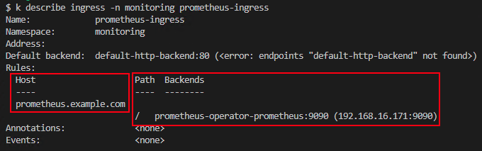

# Module 8

## Monitoring NGINX Plus Ingress with NGINX+ Dashboard, Prometheus and Grafana

A common requirement for API Gateways is to be able to see how well they are performing, both relative to the overall response times as well as how well the API runtimes are performing.  In this module we will look at a few tools that provides insights into just that.  

This workshop will walk you through how to setup and use three tools to monitor your NGINX+ Ingress Controller in your Kubernetes cluster.

By the end of the module, you will:

- Learn to access the built-in NGINX+ dashboard
- Learn to view metrics in Prometheus
- Learn to view realtime metrics in Grafana

## 1. Access and Explore the NGINX+ Dashboard

Every instance of NGINX+ has a built in web-based dashboard, displaying many of the extended metrics that NGINX+ offers.  The dashboard is enabled by default on the NGINX+ Ingress Controller (NIC), however, the port that exposes the dashboard needs to be enabled in the pod.  This is done is the deployment spec as follows:


This is defined in the spec.template.spec.containers.ports array.  View `nginx-plus-ingress.yaml` in the module1 folder to see the entire deployment spec.  The port may not be enabled by default depending on the deployment method you use.  

As configured, this port is only accessible from within the Kubernetes cluster.  While you could use a service to expose this port, in this module you will use another technique to access the Ingress pod known as a `port-forward`.  A port-forward is created with the `kubectl` command and creates a proxy from the machine where the port-forward is running to a pod running in the cluster.  This port-forward was created for you in the Windows Jumphost where kubectl is installed.  

Before viewing the dashboard, generate some traffic by running a CronJob in the cluster with:

```bash
kubectl apply -f module8/wrk-cj-api.yaml
```

This CronJob will make requests to the api.example.com/api/v1/generator API endpoint.  

In the Jumphost, access the NGINX+ dashboard by opening a new tab in the Chrome browser and clicking the bookmark in the bookmark bar called NGINX+ Dashboard:


The home page of the dashboard will show summary connection, request and response information.  This data is provided by the NGINX+ API.  You can drill down to more detailed information by clicking the links at the top of the dashboard for 1) HTTP Zones 2) HTTP Upstreams or you can return to the summary page be clicking the 3) NGINX Logo.  


Server Zones in NGINX are shared memory zones that NGINX worker processes use to share, among other things, the statistics you see on this page.  They are created when you create Server blocks in NGINX via either Ingress or VirtualServer resources.  

The Upstreams tab shows connection information between this Ingress pod and the pods that NGINX is proxying traffic to.  If you are familiar with NGINX, this is information related to the NGINX Upstream blocks.  

## 2. Exploring Prometheus

`Prometheus` is a software package that can watch and collect statistics from many different k8s pods and services.  It then provides those statistics in a simple html/text format, often referred to as the "scraper page", meaning that it scrapes the statistics and presents them as a simple text-based web page.

In our environment, Prometheus has been deployed in the `monitoring` namespace.  It is made up of deployments, daemonsets, pods and services.  

To enable NIC to export Prometheus statistics requires 3 settings:

1. Prometheus `Annotations` are enabled
2. Port `9113` is exposed on the Ingress pod
3. The Plus command-line argument `- -enable-prometheus-metrics` is enabled, to allow the collection of the NIC's statistics on that port.

These settings have already been enabled for you in this lab, but they are `not` enabled by default.  

Annotations | Port  | Plus Args
:-------------------------:|:-------------------------:|:-------------------------:
 | |

To see these settings in context, inspect the `module1/nginx-plus-ingress.yaml` file.

You may have already noticed in the first section of this module that our NIC is configured to give access to both Prometheus and Grafana.  This is done by applying an Ingress Resource to the NIC, demonstrating how the NIC can support both VS and Ingress resources simultanously.  You can inspect the Prometheus Ingress Resource by running:

```bash
kubectl describe ingress -n monitoring prometheus-ingress
```



The points of interest have been highlighted including the host that the ingress applies to as well as the path and backend.  The backend is the service exposing Prometheus.

Prometheus will collect the NGINX+ metrics from all of the running Ingress pods.  The advantage of Prometheus is that it can display historical data compared to the mostly realtime data provided by the NGINX+ Dashboard.  

Access the Prometheus UI by opening a new browser tab and clicking the Prometheus bookmark in the bookmark bar.  


Once you have opened the UI, click in the text box towards the top and start to type `nginx`.  You will see a drop down list of all of the available metrics you can choose from.


You will notice that the metrics are related to either the Ingress or NGINX itself.

Once you have chosen a metric you are interested in, click the blue `Execute` button:


You can also change the time window (x-axis) you are interested in viewing.  

Once you have graphed a metric, get additional information on the graph by hovering your cursor over the graph's line.  

You can view other cluster metrics by typing a resource of interest.  Try typing cpu, memory, pod, etc., to see metrics related to those resources.

## 3.  Exploring Metrics Through Grafana

`Grafana` is a data visualization tool, which contains a time series database and graphical web presentation tools.  Grafana imports the Prometheus scraper page statistics into its database, and allows you to create `Dashboards` of the statistics that are important to you.  There are a large number of pre-built dashboards provided by both Grafana and the k8s community, so there are many available to use. And of course, you can customize them as needed or build your own.  Finally, you can find a Grafana dashboard in the NGINX Inc. GitHub for Ingress Controller.  We'll take a look at this dashboard in this module.  

Access the Grafana dashboard by clicking the Grafana bookmark in the bookmark bar in a separate tab:


Once the Grafana page is opened, you should see the "NGINX Plus Ingress Controller" dashboard:


Notice that immediately under the dashboard title is a set of filters letting you choose a namespace, a specific NIC if there is more than one installed, a specific server zone, a specific server (pod), or a specific NGINX virtual server.  This is helpful for troubleshooting by focusing on a specific problem area.  

The dashboard is further broken up into different collapsable "panels":


The Environment Metrics panel contains good overview data.  Ingress Metrics and Upstream Metrics are similar to what you saw for the NGINX+ dashboard.  Explore these panels now.

There are two primary differences between the NGINX+ and Grafana dashboards:

1. The Grafana dashboard lets you see historical data, similar to what you saw with Prometheus.
2. The Grafana can act as a single pane of glass for multiple Ingress pods.  

Let's try out that second point.  Scale your Ingress deployment to three pods with the following command:

```bash
kubectl scale deploy -n nginx-ingress nginx-ingress --replicas=3
```

Now navigate to the dashboard home screen by clicking on the dashboard icon on the left of the page:


You will see a listing of all of the installed dashboards.  

Scroll down to the "NGINX" dashboard and select it:


You will now see basic metrics for all of the NGINX instances:


## This concludes the workshop  

-------

## References

- [Prometheus Helm Charts](https://github.com/prometheus-community/helm-charts/blob/main/charts/kube-prometheus-stack/README.md)

- [Grafana NGINX Plus IC Dashboard](https://github.com/nginxinc/kubernetes-ingress/tree/master/grafana)

Navigate to [Main Menu](../README.md))
